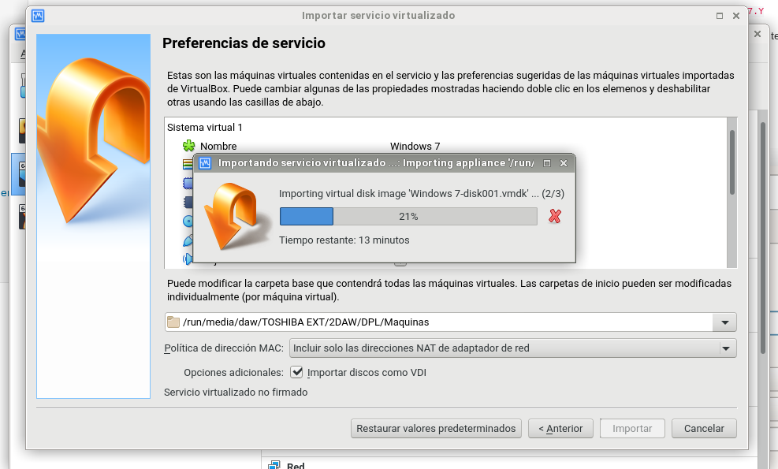
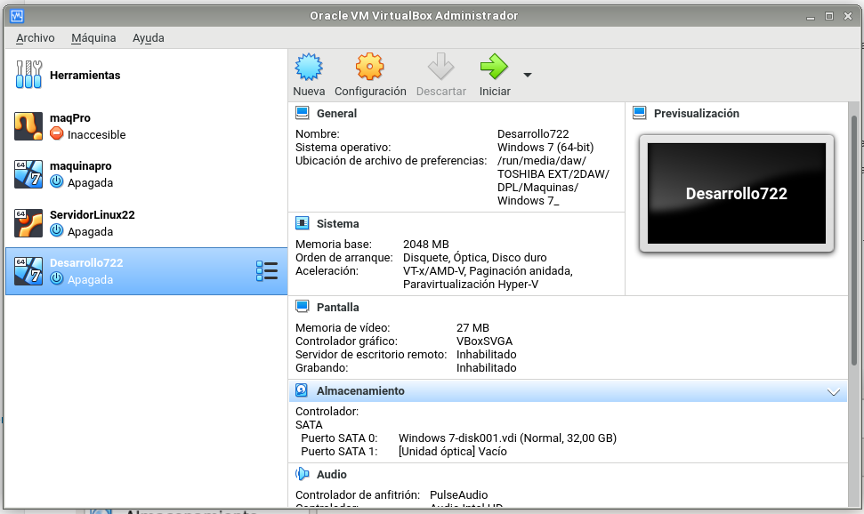
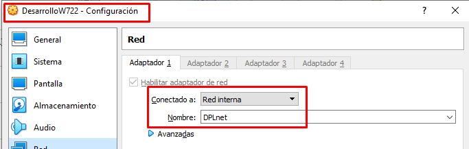
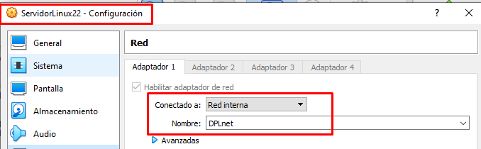
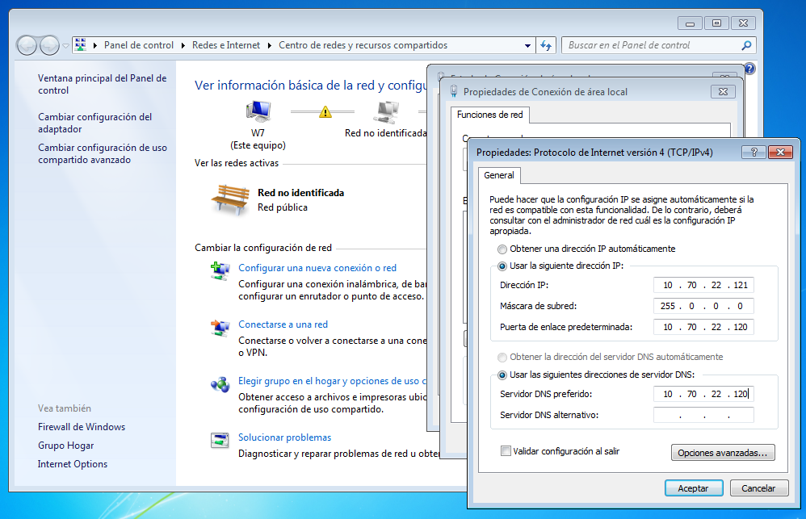
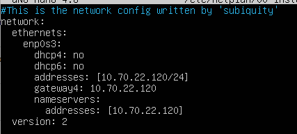
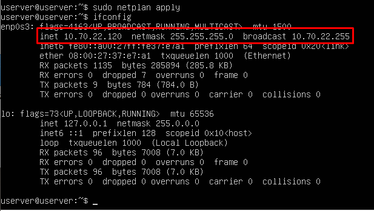
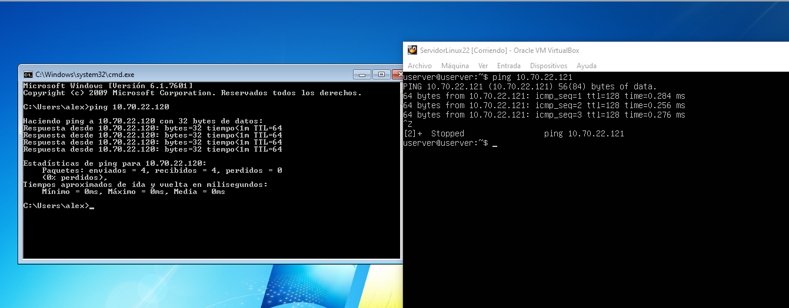

## Creando las maquinas

Para empezar creamos las maquinas virtuales a partir de las OVAS.
A las cuales en mi caso llamare DesarrolloW722 y ServidorLinux22 en mi caso, 
dado que mi pc en el aula es Marte22.

## Configuracion de adaptador de red en VBox

Para hacer esto seleccionamos la maquina, vamos a configuracion y luego
pulsamos en red, ahi procederemos al cambio a red interna.

## Configuracion de adpatador de red Windows

Para hacer esto debemos ir a:

~~~
Panel de control -> Redes e Internet -> Centro de Redes y recursos compartidos -> Conexión de área local -> Propiedades -> Protocolo de Internet versión 4 
~~~

Ahi pondremos la ip que nosotros deseemos y la ip de la maquina a la que
va a referenciar.

## Configuracion del adaptador de red en Ubuntu

Para hacer este paso dado que el comando /etc/network/interfaces no funciona
debemos usar netplan.
Una vez dentro de netplan

`sudo nano /etc/netplan/00-installer-config-yam1`

Debemos cambiar los parametros para cambiar la ip

Luego usaremos el comando

`ifconfig`

y vemos que nos ha cambiado la ip de nuesta maquina.

## Comprobacion de la configuracion y de funcionamiento.

Por ultimo para comprobar que nuestras dos maquinas se conectan
usaremos el comando ping en ambas maquinas.

En el caso de Windows:

`ping 10.70.22.120`

Y en el caso de Ubuntu:

`ping 10.70.22.121`

