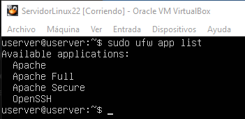

# Practica 2.2

## José Sánchez

## 1 Instalar Apache

Primero emprezaremos haciendo un 

`sudo apt update`

Esto nos devolvera la lista de los paquetes que podemos 
actualizar.
A continuacion procederemos a instalar el paquete de 
Apache. Para esto usaremos el siguiente comando:

`sudo apt install apache2`

## 2 Configurar el firewall

Para configurar el firewall primero vamos a listar los 
perfiles de aplicacion de apache.
Usaremos el siguiente comando:

`sudo ufw app list`

Como vemos nos salen los distintos perfiles de Apache.
Habilitaremos el perfil mas restrictivo.
En mi caso he dado que probablemente usaremos mas puertos 
pues habilite todos en lugar de solo el 80.

Para verificar que el cambio se ha realizado usaremos 
primero el comando ufw status, veremos que nos sale que se 
encuenta inactivo.
Para activarlo usaremos el comando ufw enable

~~~
sudo ufw status
sudo ufw enable
~~~

En mi caso no me apareció la lista de trafico HTTP.

# 3 Comprobar el estado del servidor web.

Ahora ya tendremos instalado apache. Pero podremos 
realizar una verificación usando el siguiente comando

`sudo systemctl status apache2`

Otra forma de comprobar que el servidor apache esta 
corriendo es ir a nuestro navegador en la maquina de 
Windows, ahi pondemos la ip de nuesta maquina de Ubuntu
y nos aparecera la siguiente y pagina.

# 4 Administrar el proceso de Apache.

Ahora procederemos a provar los siguientes comando de 
administacion básicos con systemctl.

> Para detener el servidor usaremos el siguiente comando.

`sudo systemctl stop apache2`

> Para iniciarlo usaremos:

`sudo systemctl start apache2`

> Para detener y luego iniciar el servicio escribiremos

`sudo systemctl restart apache2`

> Si solo realizamos cambios de la configuracion usaremos 
el siguiente para recargar sin cerrar

`sudo systemctl reload apache2`

> Si lo que queremos es que apache no se inicie 
directamente cuando iniciamos nuestra maquina usaremos

`sudo systemctl disable apache2`

> Y si el servicio se encuentra deshabilitado y queremos 
activarlo de nuevo usaremos

`sudo systemctl enable apache2`

