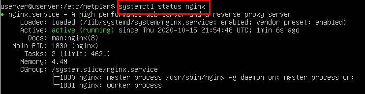

# Practica 2.3

## José Javier Sánchez

## 1. Instalar Nginx

Para instalar nginx primero hacer un apt update para listar los paquetes
disponibles y luego apt install nginx para instalarlo

~~~
sudo apt update
sudo apt install nginx
~~~

> Falta imagen

## Configurar firewall

Para este punto nos recomiendan tener habilidato el perfil mas restrictivo.
En mi caso tengo habilitado todos los puertos para futuras prácticas.
Para habilitarlo usaremos el siguiente comando:

`sudo ufw allow 'Nginx HTTP'`

## 3. Comprobar el estado del servidor web.

Posteriormente comprobamos el estado del servicio con:

`sudo systemctl status nginx`

> Falta comprobar ip en windows 7

## 4. Administrar el proceso de Nginx

Por último comprobaremos el funcionamiento de algunos de los comandos básicos 
de administracion.

> Para detener el servidor web:

`sudo systemctl stop nginx`

> Para iniciar el servidor web cuando no esta activo:

`sudo systemctl star nginx`

> Para detenerlo e iniciar el servicio de nuevo:

`sudo systemctl restart nginx`

> Recargar el servicio sin cerrar conexiones:

`sudo systemctl reload nginx`

> Para deshabilitar el servicio:

`sudo systemctl disable nginx`

> Para habilitar el servicio:

`sudo systemctl enable nginx`

  

