# Práctica 2.4 Instalacion de Tomcat en Ubuntu Server

## José Sánchez

## Instalar Tomcat 9

Para la instalacion de Tomcat haremos como en anteriores ocasiones, acutalizaremos
las listas de paquetes con

`sudo apt update`

y instalaremos Tomcat 9 con

`sudo apt install -y tomcat9 tomcat9-admin`

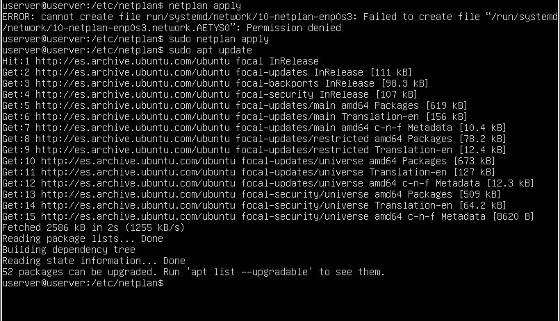

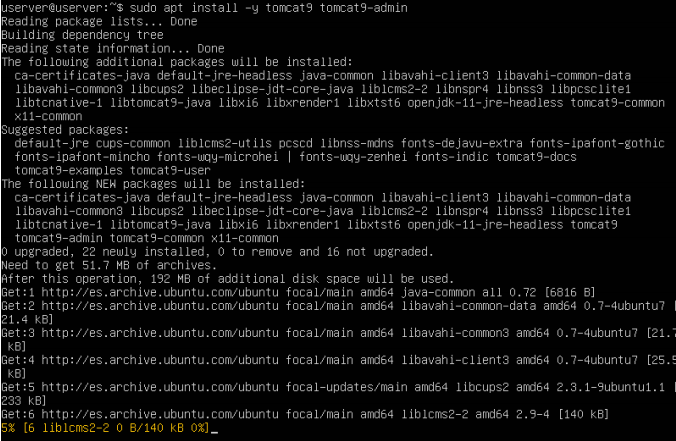

## Configurar el firewall

Para acceder al Tomcat en Ubuntu deberemos añadir la siguiente regla:

`sudo ufw allow 8080/tcp`

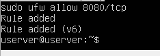

## Configuración de Tomcat9 en ubuntu server

> 3.1 Puerto de conexión

Por defecto Tomcat viene en configurado en el puerto 8080. Para evitar problemas podriamos ir al fichero server.xml
y cambiar el puerto por otro que quisieramos.

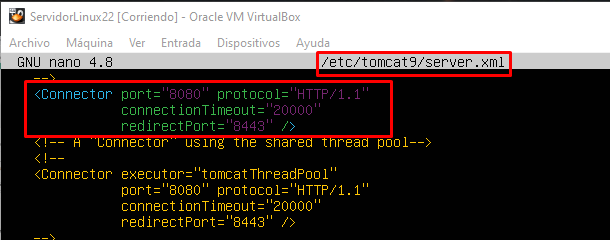

> 3.2 Usuarios de Tomcat

Algunas aplicaciones de Tomcat van a requerir de un usuario y su contraseña, como en nuestro caso el gestor de 
aplicaciones web, que va a requerir usuarios con rol maganer-gui o el gestor de maquina virtual que requerira el 
admin-gui.
Por este motivo vamos a crear un usuario con estos roles editando el archivo tomcat-users.xml

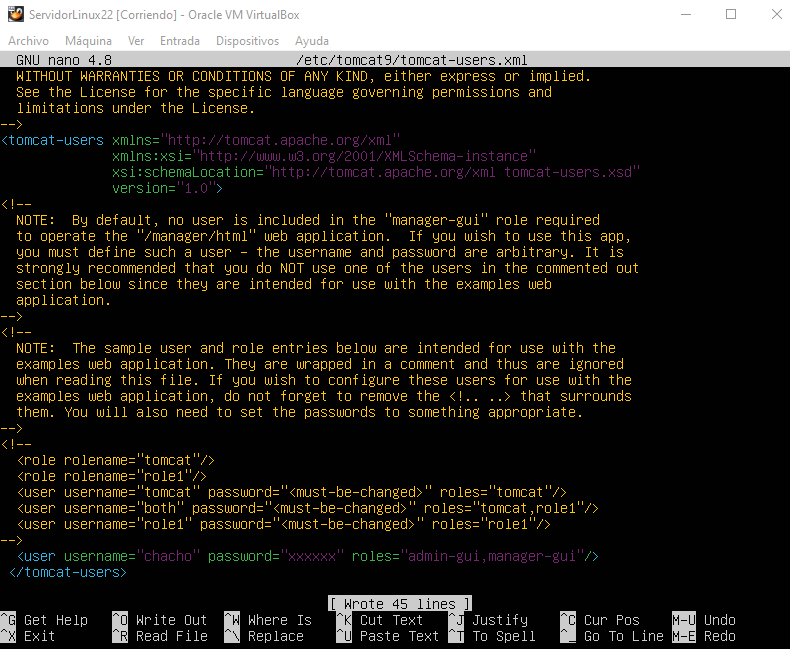

> 3.3 Acceso remoto a las aplicaciones.

En este punto vamos a tener que editar el fichero context.xml dado que hay aplicaciones que restringen en su configuracion
el acceco a la red.

Primero iremos a context.xml de la aplicacion Manager

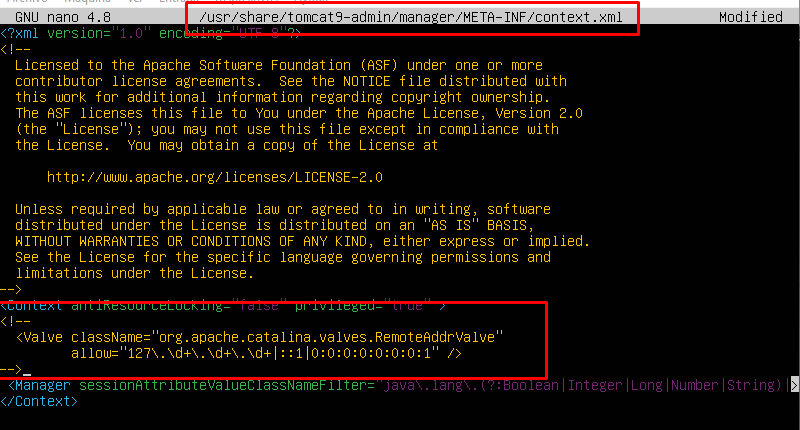

Luego repetiremos el paso en el mismo archivo pero en este caso de Host Manager

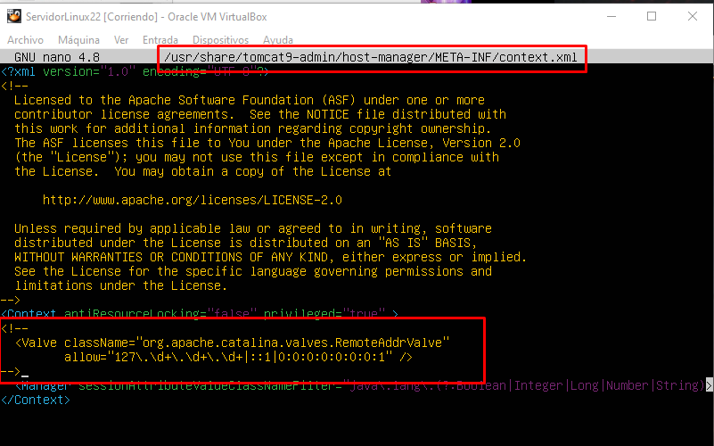

> 3.4 Aplicando los cambios a la configuración

Despues de hacer estos cambios, debemos reiniciar tomcat.
Usaremos el siguiente conando

`sudo systemctl restart tomcat9`

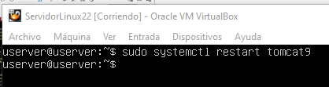

## Acceder a Tomcat 9

Ahora nos dirigiremos a nuestra maquina de Windows para comprobar que podemos acceder a Tomcat.
Abrimos el navegador e introducimos nuestra direccion ip seguida de :8080

`10.70.22.120:8080`

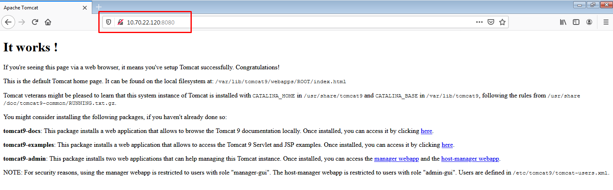

 
## Aplicacion manager

Posteriormente accedermos al gestor de aplicaciones web.
Para esto añadiremos al final de la ip puesta anteriormente /manager/html

`10.70.20.120:8080/manager/html`

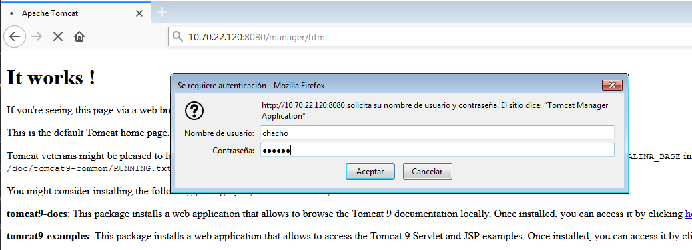

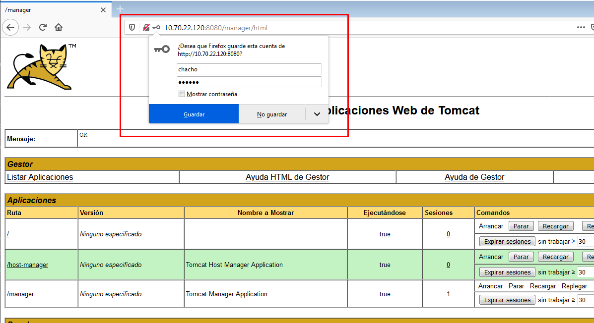

## Aplicacion Host Manager

Al igual que hicimos en el apartado anterior vamos a acceder al gestor de magina virtual de Tomcat.
Lo haremos de la misma forma, pero esta ves en vez de /manager/html vamos a escribir /host-manager/html

`10.70.20.120:8080/host-manager/html`

 
