# Practica 2.5 Instalación de LAMP en ubuntu server

## 1. Acualización del repositorio y paquetes

Para actualizar los paquetes haremos primero `sudo apt update` y luego `sudo apt upgrade`

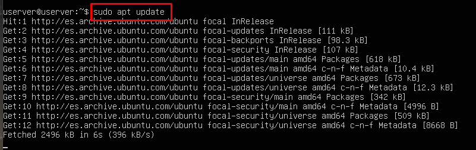

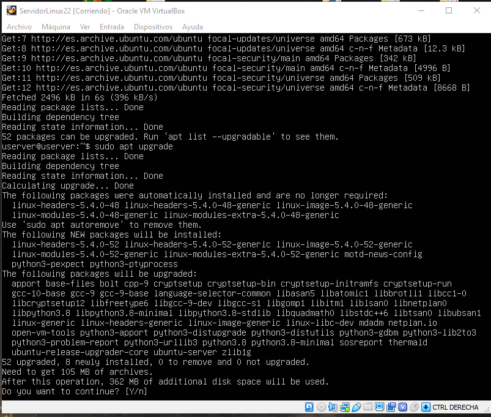

## 2. Instalación del servidor Apache

Realizaremos la instalación de apache como vimos en la práctica anterior.

## 3. Instalación del servidor de base de datos MartiaDB

Realizaremos la instalacion de mariadb con el siguiente comando

`sudo apt install mariadb-server mariadb-client`

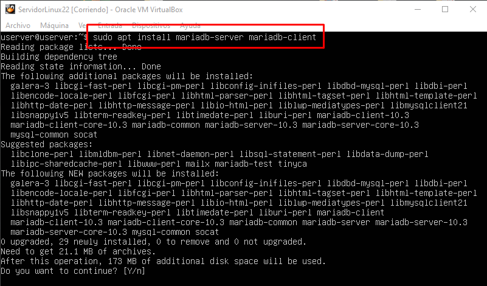

Comprobaremos el estado del servidor

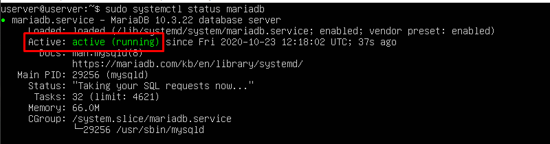

Luego ejecurtaremos `sudo systemctl enable mariadb` para permitir que se inicie
automáticamente cuando arranque la máquina.

 

Ahora ejecutaremos el script de seguridad posterior a la instalación.

`sudo mysql_secure_installation`

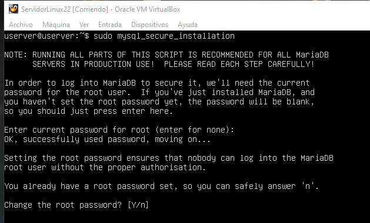

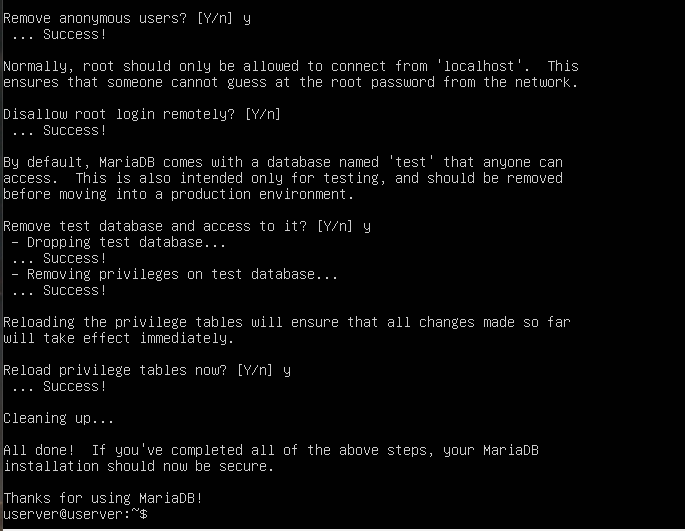

Probaremos el acceso a la base de datos como root, crearemos el usuario developer y luego entraremos como tal.

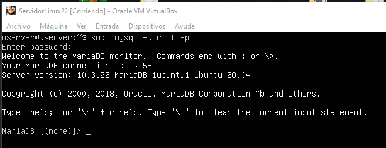

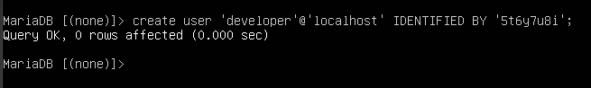

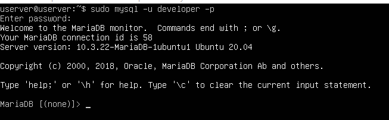

## 4. Instalación de la última versión de PHP

Instalaremos PHP y algumos módulos comunes de PHP con el siguiente comando:

`sudo apt install php7.4 libapache2-mod-php7.4 php7.4-mysql php-common php7.4-cli php7.4-common php7.4-json php7.4-opcache php7.4-readline`

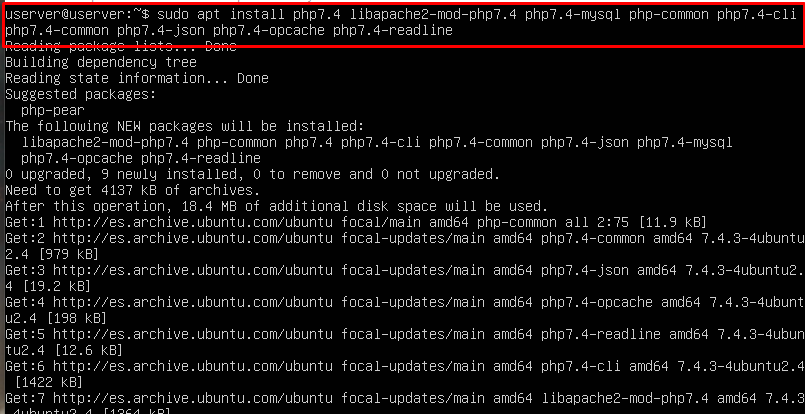

Ahora activaremos el modulo de Apache PHP usaremos los siguientes comandos

`sudo a2enmod php7.4`

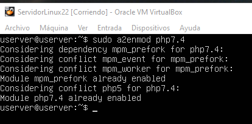

Luego haremos

`sudo systemctl restart apache2`

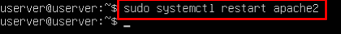

Verificaremos la versión de apache 

`php --version`

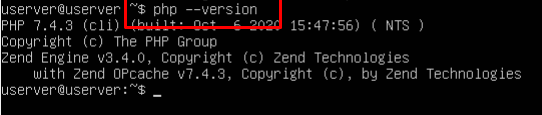

Por último crearemos el archivo vim con el codigo de php

`sudo vim /var/www/html/info.php`

Y le pondremos el siguiqnte código

`<?php phpinfo();?>`

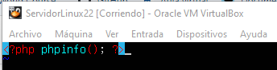

 
