# Tarea 1 Git

## Creación del repositorio

Clonamos el repositorio, usando el siguiente comando:

`git clone https://github.com/Cijo4/dpl_B_josejavier.git`

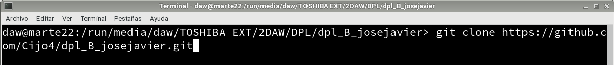

## Commit inicial

Haremos el primer commit para subir el documento Tarea1.md ya modificado

~~~
git add .
git commit -m "commit inicial"
~~~

## Push inicial

Por ultimo subiremos el cambio al repositorio con push

`git push`

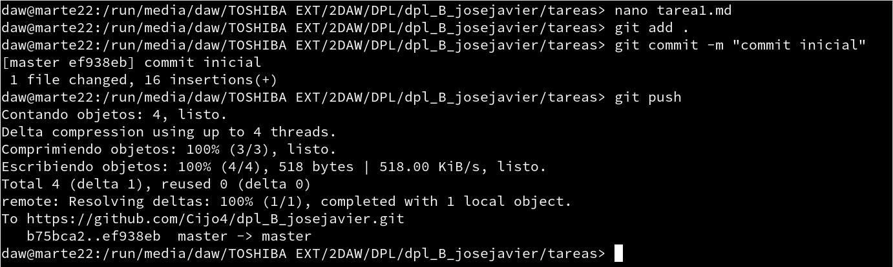

## Ignorar archivos

Creamos el archivo txt privado y la carpeta privada para 
posteriormente hacer que github los ignore.

~~~
touch privado.txt
mkdir privada
~~~

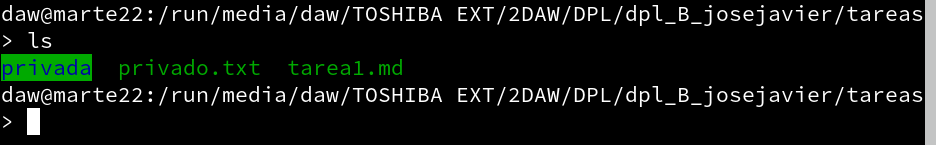

Añadimos dentro del documento .gitignore el nombre del txt y de 
la carpeta que queremos que ignore.

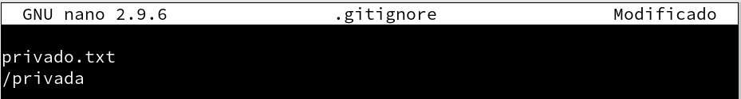

## Añadir fichero 1.txt

Ahora procedemos a crear el archivo 1.txt y lo añadimos al 
repositorio local.

~~~
touch 1.txt
git add . 
git commit -m "commit 1.txt"
~~~

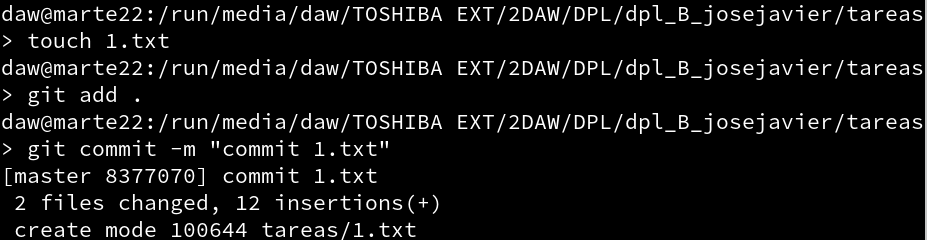

## Crear el Tag v0.1

Para crear el tag v0.1 usaremos el siguiente comando

`git tag v0.1`

Y comrpobaremos que se ha creado con el comando

`git tag`

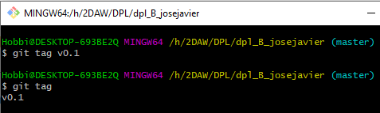

## Subir el Tag v0.1

## Configuración y uso social de GitHub

Para cambiar la foto de nuestro perfil de GitHub debemos ir a nuestro perfil, 
clicando en nuestra imagen de perfil que estará en la esquina superior derecha.
Una vez dentro de nuestro perfil clicaremos donde esta la imagen en grande a la izquierda 
que nos llevará a un menú para cambiar nuestros datos. Por último pincharemos a la derecha 
donde veremos Profile picture y ahi cambiaremos la imagen de nuestro perfil.

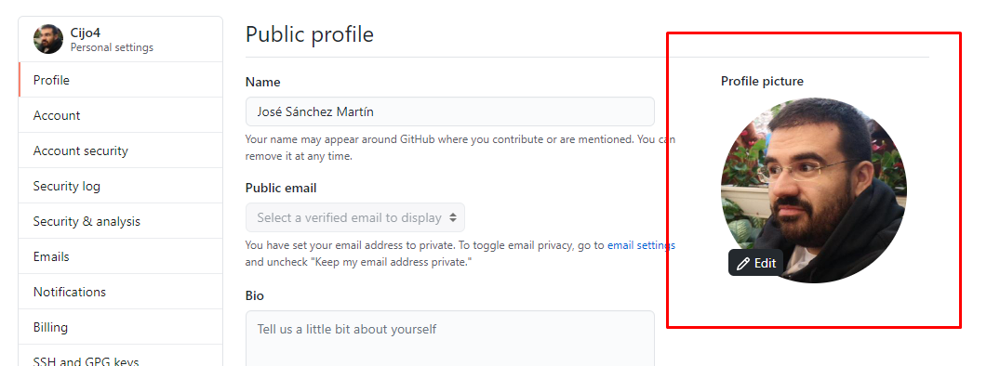

Para añadir a nuestra cuenta la autenticación en dos pasos debemos clicar en la imagen de perfil 
que se encuentra arriba a la derecha y pinchar en Settings. Luego en el menu que nos aparece a la
izquierda accederemos al apartado Account security y ahí encontraremos la opcion de activar 
la autenticación en dos pasos. En mi caso he elegido la verificación por SMS.

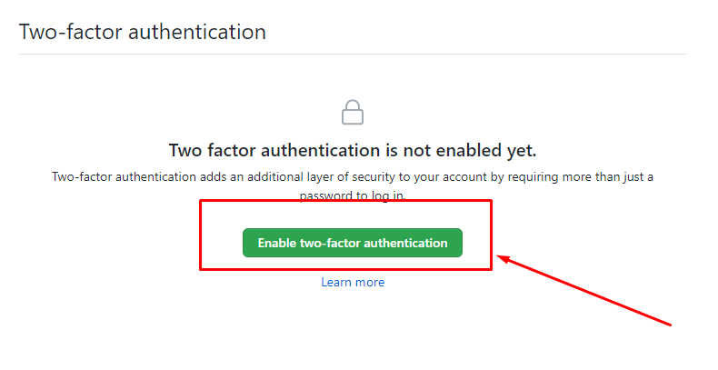
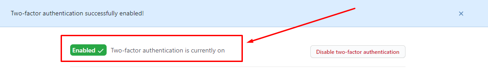
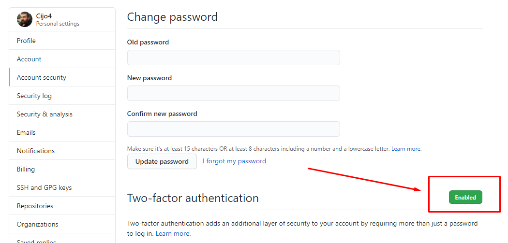

Para seguir a otro ususario sera tan facil como ir a la barra buscador de GitHub y buscar a esa 
persona, nos aparecera una lista a la izquierda de la pantalla, elegimos Users y ahi nos debería 
aparecer el usuario que buscamos y por último pulsamos el boton de follow y listo.

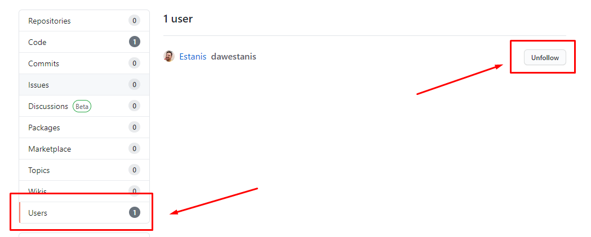

Para darle una estrella al repositorio de un compañero deberemos buscarlo y entrar a su repositorio.
Una vez ahi tendremos la opcion a la derecha para darle a una estrella.

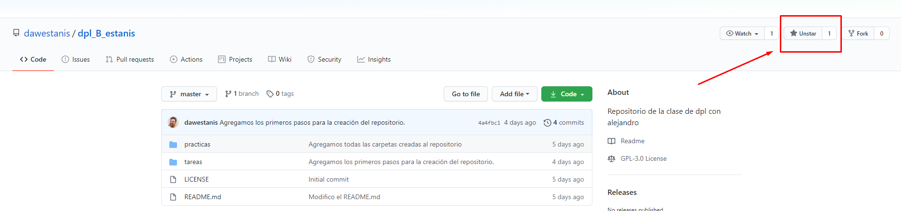

## Crear una tabla 

| Nombre | GitHub |
| -- | -- |
| Estanis | [Repositorio de Estanis](https://github.com/dawestanis/dpl_B_estanis) |
| Romen | [Repositorio de Romen](https://github.com/romentoss/dpl_B_romen) |
| Juan Daniel | [Repositorio de Juan Daniel](https://github.com/zclut/dpl_juan) |

## Colaboradores 

Para añadir a un colaborador a nuestro repositorio iremos a dicho repositorio.
Pulsamos en settings, y en el menú de la izquiera accedemos a Manager access.
Nos aparecera un botón verde a la derecha con la opcion de invitar a un colaborador.

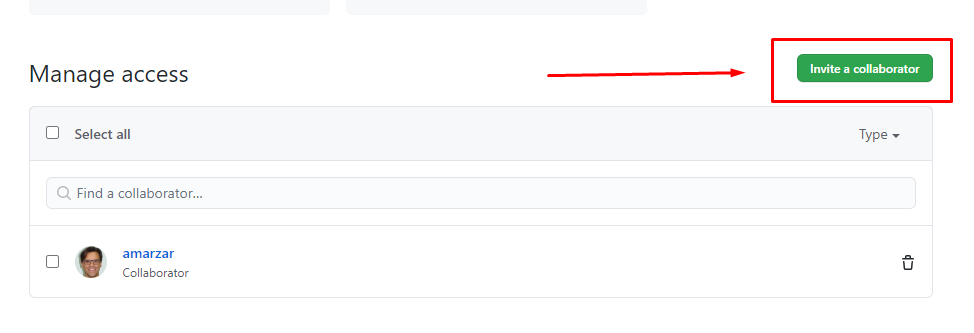
