# Tarea 1.2 Trabajando con Git

## José Sánchez 2 DAW

## Crear una rama

Para crear una rama usaremos el comando git branch mas el nombre de la rama.
Posteriormente listaremos las ramas disponibles con git branch.

~~~~

git branch v0.1
git branch

~~~~

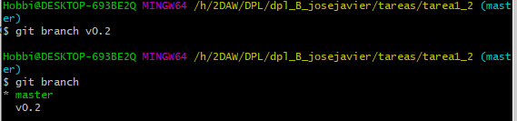

## Añadir fichero 2.txt

Para crear el fichero 2.txt usaremos el comando touch

~~~~
touch 2.txt
~~~~

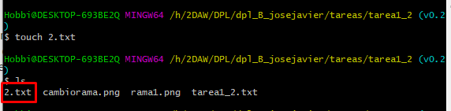

## Crear una rama remota

Para crear la rama remota y subirla al repositorio remoto usamos git push [nombre del repositorio]
y luego [el nombre de la rama]

`git push origin v0.2`

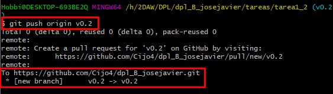

## Merge directo

Para hacer el merge primero nos pasamos a la rama master con git checkout y luego usamos
git merge v0.2.

~~~~
git checkout master
git merge v0.2
~~~~

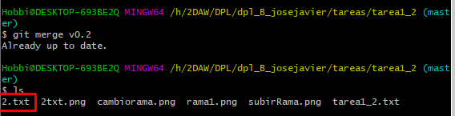

## Merge con conflicto

Añadimos hola en el txt de la rama master y hacemos commit, luego hacemo lo mismo en el 
txt de la rama v0.2 pero poniendo adios en el txt y hacemos el commit.
Veremos que al intentar hacer el merge nos dara un fallo ya que estan en conflicto dado
que los dos documentos estan modificados en las dos ramas.

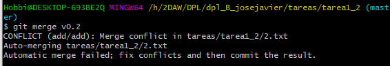

Despues de este error si accedemos al txt con nano veremos el documento de la siguiente forma

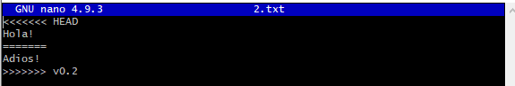

## Listado de ramas

Para listar las ramas usamos el comando git branch y nos apareceran todas las ramas 
disponibles.

`git branch`

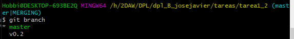

## Arreglar conflicto

Para solucionarlo debemos borrar el contenido que queremos descartar y luego hacer el 
commit correspondiente.

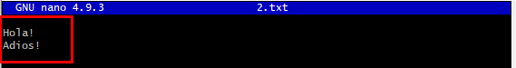

## Borrar rama

Primero nos disponemos a crear un nuevo tag, para ello usamos git tag [nombre del tag]
posteriormente vamos a eliminar la rama v0.2 que hemos creado al principio del ejercicio.

~~~~
git tag v0.2
git branch -d v0.2
~~~~

## Listado de cambios

Para listar todos los cambios, es decir, todos los commits hechos y demas usaremos el 
comando git log

`git log`

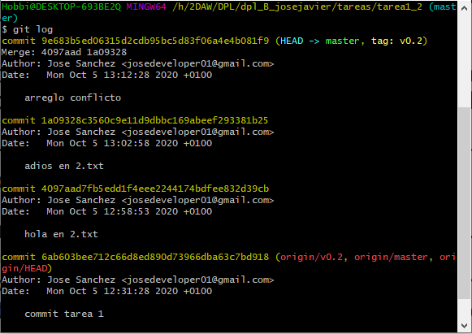

## Crear una oganizacion

Para crear una organizacion debemos ir a GitHub, una vez ahi clicamos en el "+" al lado
de nuestra foto de perfil y nos aparecera la opcion de New organization.

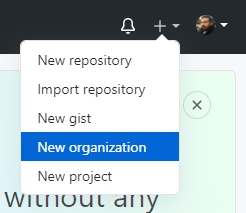

Nos llevara a un menu para crearla con su nombre correspondiente.

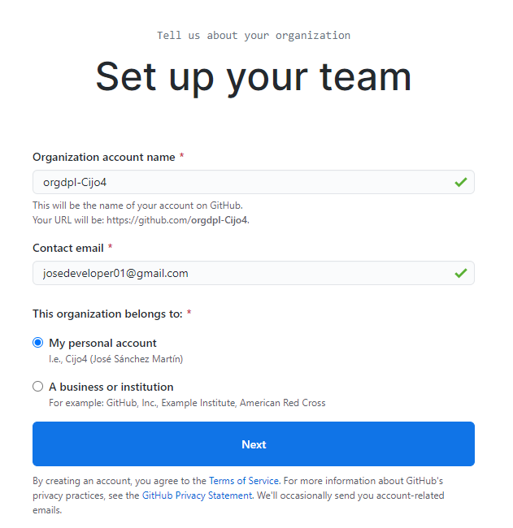

## Crear equipos

Para crear equipos debemos ir a nuestra organizacion y clicar en Teams y luego pulsar el 
botón New Team.

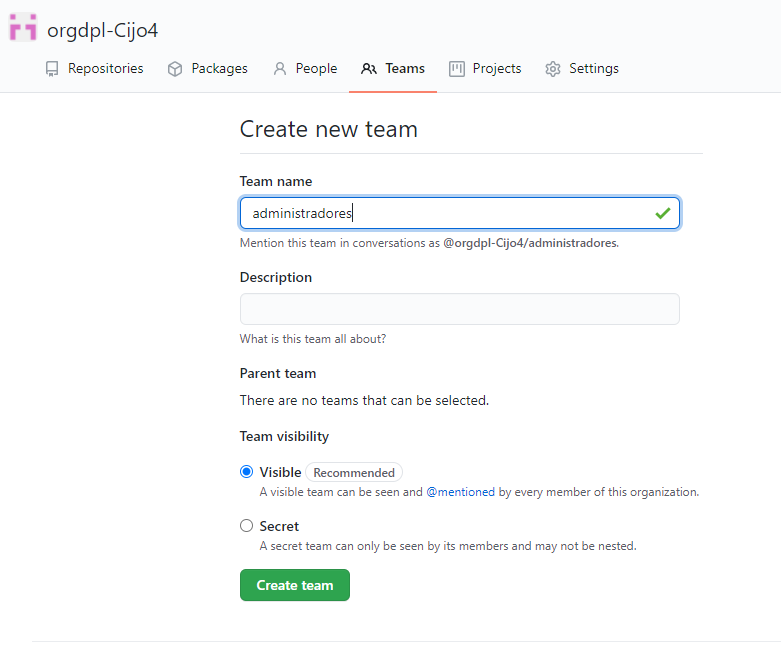

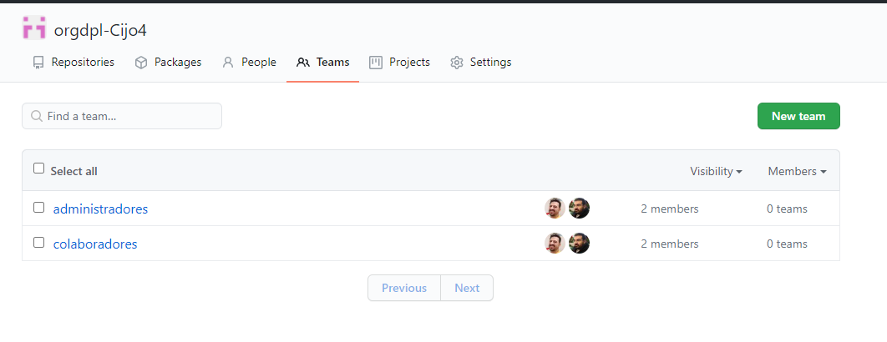
